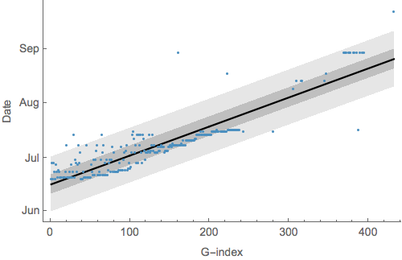
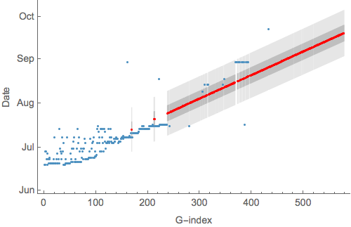
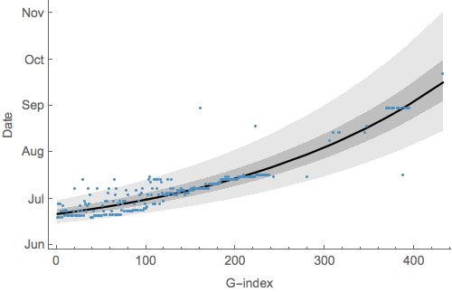
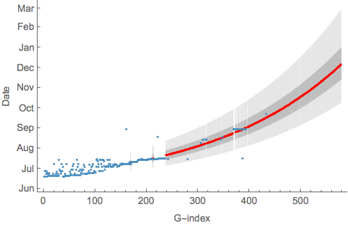

# Imputing sampling dates from sample IDs

The file [`samples.tsv`](samples.tsv) lists sample IDs and sampling dates if known. The notebook [`dates-from-sample-ids.nb`](dates-from-sample-ids.nb) reads this file and regresses ordering of samples, i.e. G3757-5 is 1, G3769-5 is 2, etc... against known dates of sampling.

## Linear model

Assuming a linear relationship between G-index and date of sampling yields:

The lighter band shows the 95% prediction interval and the darker band showing the 50% prediction interval. Adjusted *R*2 for this relationship is 0.806. 

This relationship is used to impute sample dates:

These predictions are output to the file [`linear-imputation.tsv`](linear-imputation.tsv), which includes 50% and 95% prediction intervals for each sample with unknown date.

## Exponential model

Assuming a exponential relationship between G-index and date of sampling yields:

The lighter band shows the 95% prediction interval and the darker band showing the 50% prediction interval. Adjusted *R*2 for this relationship is 0.812. 

This relationship is used to impute sample dates:

These predictions are output to the file [`exponential-imputation.tsv`](linear-imputation.tsv), which includes 50% and 95% prediction intervals for each sample with unknown date.
