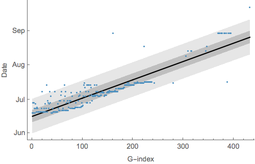
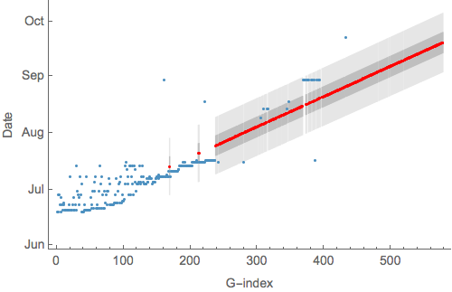

# Imputing sampling dates from sample IDs

The file [`samples.tsv`](`samples.tsv`) lists sample IDs and sampling dates if known. The notebook [`dates-from-sample-ids.nb`](`dates-from-sample-ids.nb`) reads this file and regresses a linear relationship between ordering of samples, i.e. G3757-5 is 1, G3769-5 is 2, etc... and known dates of sampling.

This gives the following result:

that shows a fairly well-behaved linear relationship between G-index and date of sampling with the lighter band showing the 95% prediction interval and the darker band showing the 50% prediction interval. *R*2 for this relationship is 0.81. The only issue here is that the distribution of dates for a given G-index does not appear normal. 

This relationship is used to impute sample dates:

These predictions are output to the file [`samples-imputed.tsv`](`samples-imputed.tsv`), which includes 50% and 95% prediction intervals for each sample with unknown date.
