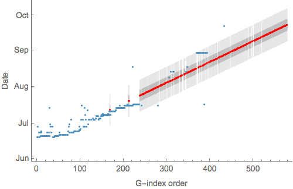
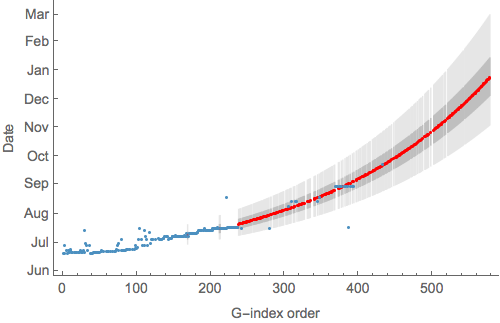
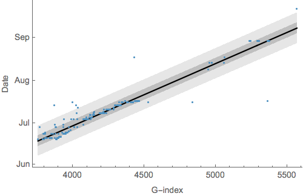

# Imputing sampling dates from sample IDs

The file [`samples.tsv`](samples.tsv) lists sample IDs and sampling dates if known. The notebook [`dates-from-sample-ids.nb`](dates-from-sample-ids.nb) reads this file and regresses sample ID against known date of sampling.

Only the first sample is used when a patient has multiple samples. For example, patient G3892 has two samples G3892-1 (dated 2014-06-20) and G3892-2 (dated 2014-07-08). In this case, I only use G3892-1.

The goal is to predict the date of sampling for samples without known dates. Here, I only predict dates for first isolations.

## Samples ordered by G-index

In this case, the predictor is the order of samples when sorted by their G-index, so for example, G3757-5 is 1, G3769-5 is 2, G3789-3 is 3, etc...

### Linear model

Assuming a linear relationship between G-index and date of sampling yields:

The lighter band shows the 95% prediction interval and the darker band showing the 50% prediction interval. Adjusted *R*2 for this relationship is 0.874. 

This relationship is used to impute sample dates:

These predictions are output to the file [`ordered-linear-imputation.tsv`](ordered-linear-imputation.tsv), which includes 50% and 95% prediction intervals for each sample with unknown date.

### Exponential model

Assuming a exponential relationship between G-index and date of sampling yields:

The lighter band shows the 95% prediction interval and the darker band showing the 50% prediction interval. Adjusted *R*2 for this relationship is 0.901.

This relationship is used to impute sample dates:

These predictions are output to the file [`ordered-exponential-imputation.tsv`](ordered-exponential-imputation.tsv), which includes 50% and 95% prediction intervals for each sample with unknown date.

## Samples directly encoded by G-index

In this case, the predictor is taken directly from the G-index, so for example, G3757-5 is 3757, G3769-5 is 3769, G3789-3 is 3789, etc...

### Linear model

Assuming a linear relationship between G-index and date of sampling yields:

The lighter band shows the 95% prediction interval and the darker band showing the 50% prediction interval. Adjusted *R*2 for this relationship is 0.917. 

This relationship is used to impute sample dates:

These predictions are output to the file [`direct-linear-imputation.tsv`](direct-linear-imputation.tsv), which includes 50% and 95% prediction intervals for each sample with unknown date.

### Exponential model

Assuming a exponential relationship between G-index and date of sampling yields:

The lighter band shows the 95% prediction interval and the darker band showing the 50% prediction interval. Adjusted *R*2 for this relationship is 0.839. 

This relationship is used to impute sample dates:

These predictions are output to the file [`direct-exponential-imputation.tsv`](direct-exponential-imputation.tsv), which includes 50% and 95% prediction intervals for each sample with unknown date.

## Discussion

The direct / linear model gives the best adjusted *R*2 to the training data at 0.917. However, this model may under-estimate the most recent samples (placing them in Oct rather than Nov).
